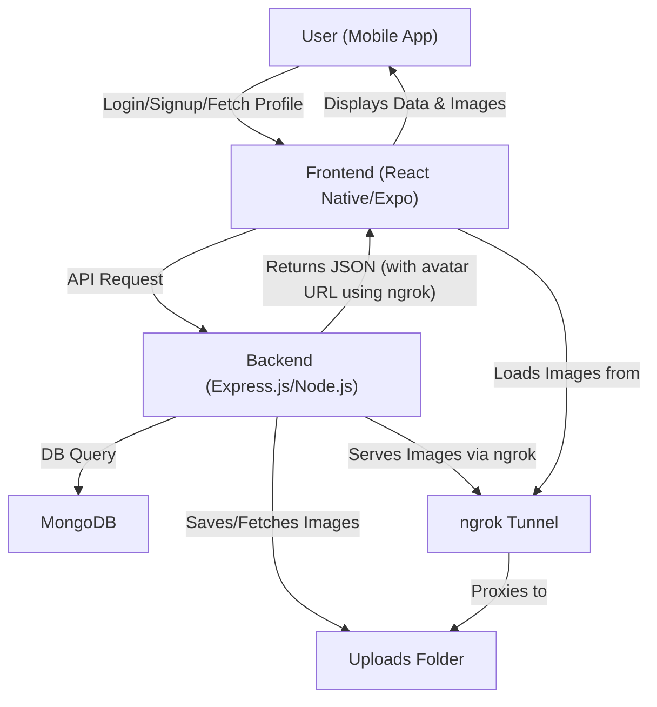

# Fitness Tracker App

---

## System Architecture



---

## Project Structure

```
Fitness_APP/
  fitness-tracker-backend/   # Node.js/Express/MongoDB backend
  FitnessAPP2/               # React Native/Expo frontend
```

---

## Backend Setup (Node.js/Express)

### 1. Install Dependencies
```bash
cd fitness-tracker-backend
npm install
```

### 2. Environment Variables
Create a `.env` file in `fitness-tracker-backend/`:
```
MONGO_URI=your_mongodb_connection_string
JWT_SECRET=your_jwt_secret
EMAIL_USER=your_gmail_address
EMAIL_PASS=your_gmail_app_password
NGROK_URL=https://your-ngrok-domain.ngrok-free.app
```

### 3. Start the Backend
```bash
npm run dev   # for development (nodemon)
# or
npm start     # for production
```

### 4. Start ngrok (for public API & image access)
```bash
ngrok http 8083
```
- Copy the HTTPS URL from ngrok and set it as `NGROK_URL` in your `.env` file.

---

## Frontend Setup (React Native/Expo)

### 1. Install Dependencies
```bash
cd FitnessAPP2
npm install
```

### 2. Configure API URL
- In `FitnessAPP2/api.js`, set `API_URL` and `SERVER_URL` to your ngrok URL:
  ```js
  const API_URL = 'https://your-ngrok-domain.ngrok-free.app/api';
  const SERVER_URL = 'https://your-ngrok-domain.ngrok-free.app/';
  ```

### 3. Start the App
```bash
npm start
```
- Scan the QR code with Expo Go (Android/iOS) or run on a simulator.

---

## Features
- User authentication (signup/login/forgot password)
- Profile management (with avatar upload)
- Step tracking (pedometer)
- Water intake tracking
- Workout logging
- BMI calculation
- Achievements

---

## API Endpoints
- `POST   /api/auth/signup`
- `POST   /api/auth/login`
- `POST   /api/auth/forgot-password`
- `POST   /api/auth/verify-otp`
- `POST   /api/auth/reset-password`
- `GET    /api/user/profile`
- `PUT    /api/user/profile`
- `POST   /api/steps`
- `GET    /api/steps`
- `POST   /api/water`
- `GET    /api/water`
- `POST   /api/workouts`
- `GET    /api/workouts`
- `POST   /api/bmi`
- `GET    /api/bmi`

---

## Image Uploads & Access
- User avatars are stored in `/Uploads/` on the backend.
- The backend always returns avatar URLs using your ngrok domain (never localhost).
- The frontend loads images via the ngrok URL.

---

## Troubleshooting
- **Images not loading?**
  - Make sure ngrok is running and the backend is started.
  - Ensure `NGROK_URL` is set correctly in both backend `.env` and frontend `api.js`.
- **Network request failed?**
  - Check your phone and computer are on the same network.
  - Restart ngrok if the tunnel closes.
- **Expo Notifications**
  - Not supported in Expo Go. Use a development build for push notifications.
- **CORS Issues**
  - The backend allows static file serving for `/Uploads/`.

---

## Development Flow
1. Start MongoDB (local or Atlas)
2. Start backend (`npm run dev`)
3. Start ngrok (`ngrok http 8083`)
4. Update ngrok URL in `.env` and frontend `api.js`
5. Start frontend (`npm start` in `FitnessAPP2`)
6. Use Expo Go or a simulator to test

---

## Contact & Credits
- Built by Suraj & contributors
- For educational use 